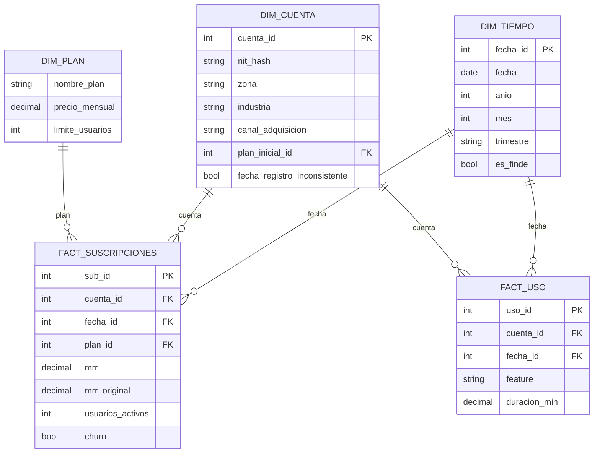

# Esquema en estrella: NovaApp Insights

## Granularidad
- **fact_suscripciones:** una fila por cuenta y por mes. La pareja (cuenta_id, fecha_id) es única y todas las fechas son día 1 de cada mes.
- **fact_uso:** una fila por cada evento de uso registrado (uso_id).

## Tablas de control (fuera de la estrella, sin FKs a las dimensiones)
- **stg_rechazos:** cuarentena de registros con llaves huérfanas o fechas fuera de calendario. Llave única (tabla_origen, id_origen).
- **ejecucion_etl:** historial de cargas con sus contadores.
- **bitacora_cambios:** auditoría de decisiones (qué se corrigió, qué no y por qué), ligada a ejecucion_etl.